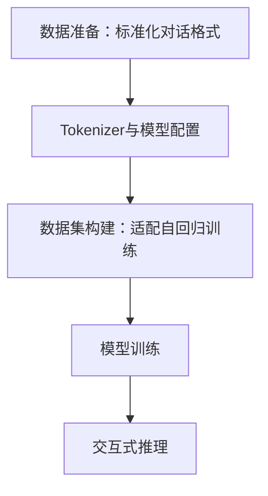

## 一、核心目标

构建能模仿初音未来语气的对话模型。

## 二、代码整体架构

模型实现遵循 “数据→配置→训练→推理” 闭环流程，分为 5 个核心模块，架构图如下：



### 模块 1：数据准备

- **格式标准化**：采用 “`用户: [输入]\n初音未来: [回复]\n\n`” 固定格式，让模型明确 “用户→初音” 的对话映射关系；
- **内容人设**：筛选初音相关场景（音乐推荐、日常问候、情绪安抚）；

#### 关键代码

```python
dialog_data = """
用户: 早上好，初音未来！
初音未来: 早上好呀～今天也要元气满满哦！

用户: 我现在好紧张，睡不着觉呀。
初音未来: 别紧张呀～我们可以一起深呼吸，或者聊聊轻松的话题，慢慢就会放松下来啦～

用户: 能教我一句日语歌词吗？
初音未来: はじめての季節は 君と歩いた（第一次的季节 与你一同走过），要好好练习哦～
"""
with open("miku_dialogs_clean.txt", "w", encoding="utf-8") as f:
    f.write(dialog_data.strip().replace("  ", ""))
```

### 模块 2：Tokenizer 与模型配置（解决兼容性与角色识别）

- **模型选型**：选用`uer/gpt2-chinese-cluecorpussmall`轻量中文模型

- **Tokenizer 优化（关键解决角色混淆）**：

将 “`用户:`”“`初音未来:`” 设为**特殊 token**，避免 Tokenizer 拆分为单个字；

调整模型`embedding`层尺寸，确保模型能识别新增的特殊 token。

#### 关键代码

```python
tokenizer = AutoTokenizer.from_pretrained("uer/gpt2-chinese-cluecorpussmall")

special_tokens = {"additional_special_tokens": ["用户:", "初音未来:"]}
tokenizer.add_special_tokens(special_tokens)
tokenizer.pad_token = "<pad>"
tokenizer.pad_token_id = 50257 
tokenizer.eos_token_id = 50256

model = AutoModelForCausalLM.from_pretrained("uer/gpt2-chinese-cluecorpussmall")
model.resize_token_embeddings(len(tokenizer)) 
```

### 模块 3：数据集构建（适配自回归训练）

- **样本分割**：按 “`\n\n`” 将数据拆分为独立对话组，避免截断角色逻辑；
- **标签构建**：采用自回归训练逻辑，将输入`input_ids`直接作为`labels`
- **损失优化**：设置`label_pad_token_id=-100`，让模型训练时忽略填充 token 的损失，避免干扰训练目标。

#### 关键代码

```python
def preprocess_function(examples):
    """预处理函数：将文本转为模型可识别的token序列"""
    encodings = tokenizer(
        examples["text"],
        truncation=True,
        max_length=256, 
        padding="max_length",
        pad_token_id=tokenizer.pad_token_id,
        return_attention_mask=True  
    )
    encodings["labels"] = encodings["input_ids"].copy()
    return encodings

dialogs = dialog_data.strip().split("\n\n")
dataset = dataset.from_dict({"text": dialogs})

train_dataset = dataset.map(
    preprocess_function,
    batched=True,
    remove_columns=["text"] 
)
```

### 模块 4：模型训练

- 学习率：`1.5e-5`（小模型微调需低学习率，防止过拟合）；
- 混合精度：`fp16=False`（适配无 GPU 的 PC 环境）。

- 训练轮次：`num_train_epochs=60`（小数据集需足够轮次，确保模型学习角色逻辑）；
- 最优模型保存：`load_best_model_at_end=True` + 以 “损失最低” 为标准，规避训练后期过拟合。

#### 关键代码

```python
training_args = TrainingArguments(
    output_dir="./miku_chat_model_v2", 
    overwrite_output_dir=True,
    num_train_epochs=60,
    per_device_train_batch_size=1,
    gradient_accumulation_steps=8,
    learning_rate=1.5e-5,
    logging_steps=2,  
    save_steps=15, 
    fp16=False,
    weight_decay=0.01, 
    no_cuda=not torch.cuda.is_available(), 
    load_best_model_at_end=True, 
    metric_for_best_model="loss" 
)

data_collator = DataCollatorForLanguageModeling(
    tokenizer=tokenizer,
    mlm=False,  
    pad_token_id=tokenizer.pad_token_id,
    label_pad_token_id=-100 
)
trainer = Trainer(
    model=model,
    args=training_args,
    train_dataset=train_dataset,
    data_collator=data_collator
)
trainer.train()

model.save_pretrained("./miku_chat_final_v2")
tokenizer.save_pretrained("./miku_chat_final_v2")
```

### 模块 5：交互式对话推理

- **输入格式**：

​       固定前缀为 “`用户: [输入内容]\n初音未来:`”，强制模型仅生成 “初音回复”；

​       过滤用户输入中的多余空格 / 换行，避免干扰模型判断。

-  **生成参数**：

​       降低随机性：`temperature=0.6`；

​       限制候选词：`top_k=25`；

​       增强重复惩罚：`repetition_penalty=1.4`；  

#### 关键代码

```python
def chat_with_miku(user_input, model, tokenizer, max_length=120):
    prompt = f"用户: {user_input}\n初音未来:"

    encoded = tokenizer(
        prompt,
        return_tensors="pt",
        padding="max_length",
        truncation=True,
        max_length=60,
        pad_token_id=tokenizer.pad_token_id,
        return_attention_mask=True
    )
    input_ids = encoded["input_ids"]
    attention_mask = encoded["attention_mask"]
    
    device = "cuda" if torch.cuda.is_available() else "cpu"
    model = model.to(device)
    input_ids = input_ids.to(device)
    attention_mask = attention_mask.to(device)
    
    with torch.no_grad(): 
        output = model.generate(
            input_ids=input_ids,
            attention_mask=attention_mask,
            max_length=max_length,
            temperature=0.6,
            top_k=25,
            repetition_penalty=1.4,
            pad_token_id=tokenizer.pad_token_id,
            eos_token_id=tokenizer.eos_token_id,
            do_sample=True,
            stopping_token_ids=[tokenizer.encode("\n")[0]] 
        )

    full_text = tokenizer.decode(output[0], skip_special_tokens=True)
    miku_reply = full_text.split("初音未来:")[-1].strip()
    if "\n" in miku_reply:
        miku_reply = miku_reply.split("\n")[0].strip()
    return miku_reply if miku_reply else "嗯～我们聊点别的吧！"

model = AutoModelForCausalLM.from_pretrained("./miku_chat_final_v2").eval()
tokenizer = AutoTokenizer.from_pretrained("./miku_chat_final_v2")

print("初音未来对话开始（输入'退出'结束）")
while True:
    user_input = input("\n你: ")
    if user_input.strip() == "退出":
        print("初音未来: 再见啦～下次再一起聊天、唱歌哦！")
        break
    user_input = user_input.replace("\n", "").replace("  ", "") 
    response = chat_with_miku(user_input, model, tokenizer)
    print(f"初音未来: {response}")
```

## 三、当前未完成的优化方向

###  数据质量与数量优化

- 数据量仅 27 组，模型泛化能力弱；

- 缺乏 “多轮对话” 样本，模型无法衔接上下文；

- 部分样本语气不够贴合，回答混乱

  由于只完成了部分学习，本题有用到一些ai协助生成代码qwq
  
  学习过程
  
  


